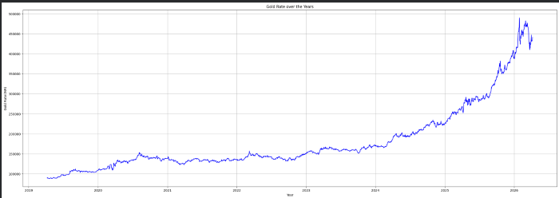
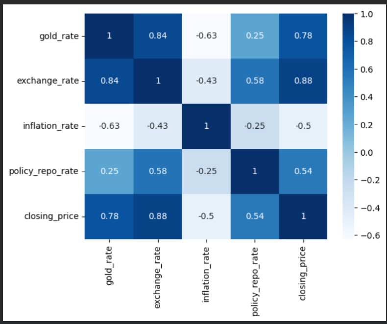
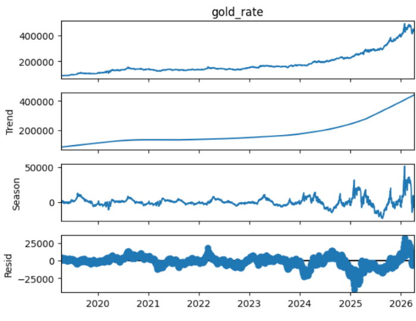
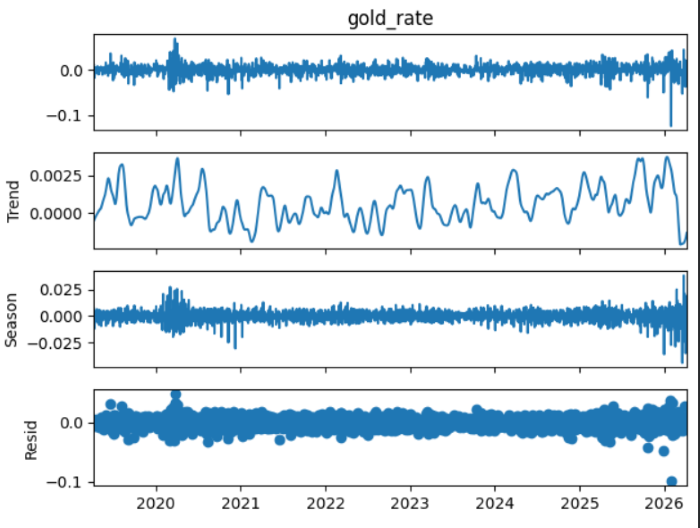
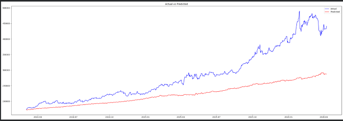
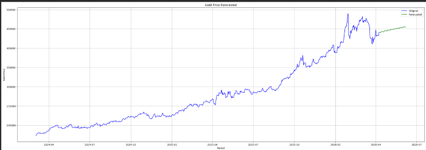

# Gold Rate Forecasting in INR

Forecasted future gold prices with macroeconomic indicators to understand how the factors influence the gold prices. 
Achieving a MAPE of 17.69%.

## Overview
This project forecasts the future gold prices in India using historical gold data along with **NIFTY50, USD/INR exchange rate,
Inflation rate and Repo rate** as exogenous variables.

The forecasting model is built using the SARIMAX(Seasonal AutoRegressive Integrated Moving Average with Exogenous Variables) algorithm,
which captures both time series patterns and influence of external variables.

## Problem Statement
Gold prices are influenced by various economic and market factors. Accurate forecasting of gold rates can help investors, traders
or financial analysts make informed decisions.

## Dataset
Historical data of 

GOLD PRICE, USD/INR EXCHANGE RATE and NIFTY50 (Indian stock market index) was collected using **Yahoo Finance API (yfinance)** 

INFLATION and REPO RATE: [RBI Database](https://data.rbi.org.in/DBIE/#/dbie/home)

NOTE: Each gold price represents 100 troy ounces of gold.

### Data Period:
 • April 2019 - April 2026

## Project Workflow
### 1. Data Collection

 Downloaded the historical data 

### 2. Data Preprocessing

 • Date indexing

 • Handling missing values

 • Data Transformation

 • Feature selection

### 3. Exploratory Data Analysis

 • Distribution Analysis

 • Trend Analysis

 • Correlation Analysis

 • Time Series Decomposition

### 4. Stationarity Testing

  Applied Augmented Dickey-fuller (ADF) Test to verify stationarity.

### 5. Feature Engineering

 • Log Transformation

 • Differencing

 • Creation of exogenous variables

### 6. Model Building

 Implemented a SARIMAX model with:

 Order = (2,0,1)

 Seasonal Order = (2,1,1,7)

### 7. Evaluation

#### Performance Metrics and Results
Root Mean Squared Error: 78080.45

Mean Absolute Error: 58524.94

Mean Absolute Percentage Error(MAPE): 17.69%

### 8. Future Forecasting

 Forecasted the gold prices for next 60 days using predicted exogenous variables.

## Tools and Technologies 
 • Python

 • Yahoo Finance API
 
 • Numpy

 • Pandas

 • Matplotlib
 
 • Seaborn

 • Statsmodel

 • Scikit-learn

 • Jupyter Notebook

## Visualizations
  ### Gold Price Trend
 

### Correlation Heatmap
 

### STL Decomposition Before and After Transformation
 
 

### Actual vs Predicted data
 

### Future Gold Price Forecast
 

## Conclusion
The gold price was highly noisy and subject to sudden geopolitical escalations resulting a MAPE score of 17.69%, still the SARIMAX model successfully captures trends and seasonality (seasonal_order=(2,1,1,7) ).

Gold in India functions as a safe-haven asset, an inflation hedge and currency shield. The project models how 4 distinct macroeconomic drivers influence
gold rate.

- **USD/INR Exchange Rate:** Gold is globally priced in USD. A weakening Rupee (higher USD/INR) mechanically drives up the local price of gold in India, creating a strong positive correlation.
  
- **NIFTY50 Index:** The stock market represents risk. When the stock market crashes, panicking investors pull their money out of shares and buy gold because it is a safe place to hide cash.
  
- **Repo Rate:** The RBI raises interest rates so people can earn higher, safer returns on fixed deposits and bonds. Because gold does not pay any interest, investors switch their cash out of gold and into bank deposits.
- **Inflation Rate:** When inflation rises, cash loses its purchasing power it drives people to buy gold to protect their wealth. As inflation goes up, gold prices usually climb with it, showing a positive relationship.

## Future Improvements
 • Augmenting additional economic indicators
 
 • Build real time forecasting dashboard

